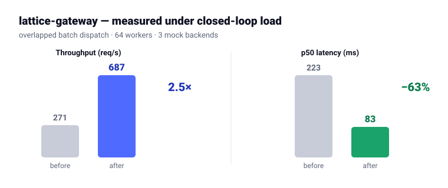

<!--
  GitHub PROFILE README for Rainsongit.
  → In the repo named exactly  Rainsongit  (github.com/Rainsongit/Rainsongit),
    replace README.md with this file. It renders atop github.com/Rainsongit.
  Links assume lattice-gateway, repolens, sec-filings-rag, Hallucinations_VLMs
  live on the Rainsongit account. Add the sec-filings-rag live demo URL once deployed.
-->

# Pranay Reddy Baireddy

**I build LLM systems that stay fast under load and refuse to hallucinate when they don't know.**

M.S. Applied AI, Stevens Institute of Technology (2026) · Jersey City, NJ

---

## Featured projects

| Project | Summary | Results |
|---|---|---|
| **[lattice-gateway](https://github.com/Rainsongit/lattice-gateway)** | A fault-tolerant gateway in front of a fleet of model servers — routing, circuit breakers, batching, semantic cache | Handles **2.5× more traffic before saturation** and cuts latency **63%** (p50 223→83 ms); reroutes automatically when a backend fails. 32 tests. |
| **[repolens](https://github.com/Rainsongit/repolens)** | Ask questions about any codebase — grounded answers with source citations | **Never invents an answer** — cites the exact file, and CI fails the build if retrieval quality drops. Zero runtime dependencies. |
| **[sec-filings-rag](https://github.com/Rainsongit/sec-filings-rag)** | Ask questions over 10-K filings; **refuses to answer outside the retrieved evidence** | Answers only what the filings support and refuses everything else — held to **100% on both retrieval and refusal** by an eval gate in CI. FastAPI + React, Docker. |

The thread across all three: **measure it, and refuse to guess.**

> **A system without an eval harness is a demo, not a system.**

<!-- Add lattice_benchmark.svg to this repo (next to README.md) so this renders. -->

---

## Research

Built an **adaptive hallucination-mitigation framework for vision-language models** that improved F1 by **3.6 points across 9,000 benchmark queries** by routing between decoding strategies based on the model's own uncertainty.
→ **[Report & code](https://github.com/Rainsongit/Project_800)** *(paper in progress)*

---

## Stack

**Languages** — Python · TypeScript · C++ · SQL
**Infrastructure** — Docker · FastAPI · CI/CD · Prometheus · PostgreSQL · AWS/GCP
**AI** — PyTorch · Transformers · RAG · vector search

Currently focused on **reliable agent systems, inference infrastructure, and evaluation.**

📫 **pranaybaireddy08@gmail.com** · [LinkedIn](https://linkedin.com/in/pranaybaireddy)
